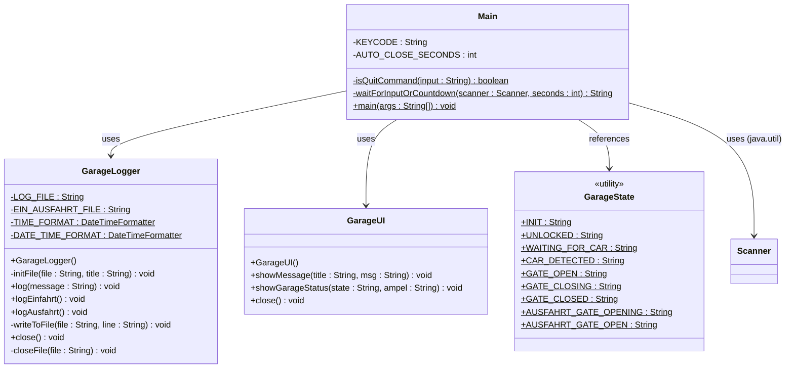

# UML Klassendiagramm – modul_320_projekt

Dieses Dokument enthält das UML-Klassendiagramm basierend auf dem aktuellen Code-Stand.



    Main ..> GarageUI : uses
    Main ..> GarageLogger : uses
    Main ..> GarageState : uses constants
```
